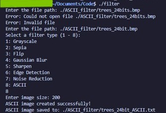

# Filter Program
This is a BMP image filtering program controlled by the command line. It inputs BMP files; if not, it converts the file to a 24 bit BMP using GraphicsMagick. The user can select one of the seven filters: Grayscale, Sepia, Flip, Gaussian Blur, Sharpen, Edge Detection, Noise Reduction, or ASCII. Some filters have the option to set their strength. The filter is applied to the image and saved as a new BMP file or text file if the ASCII filter.

Note: This program works with 24bit BMPs, meaning it will convert 32bit BMPs to 24bit.

## IMPORTANT: Dependices
This program was implemented using [GraphicsMagick](http://www.graphicsmagick.org/index.html) 1.3.42 2023-09-23, this is for converting to a 24 bit BMP. Note: This is not needed if you image is already in a 24bit BMP format. 
### Installation:
#### Linux (Ubuntu)
    sudo apt update
    sudo apt install graphicsmagick
#### MacOS
Install Homebrew:

    /bin/bash -c "$(curl -fsSL https://raw.githubusercontent.com/Homebrew/install/HEAD/install.sh)"
    
Then install graphicsmagick:

    brew install graphicsmagick
#### Windows
Follow their [installation guide](http://www.graphicsmagick.org/INSTALL-windows.html)
: http://www.graphicsmagick.org/INSTALL-windows.html

## Usage Example

